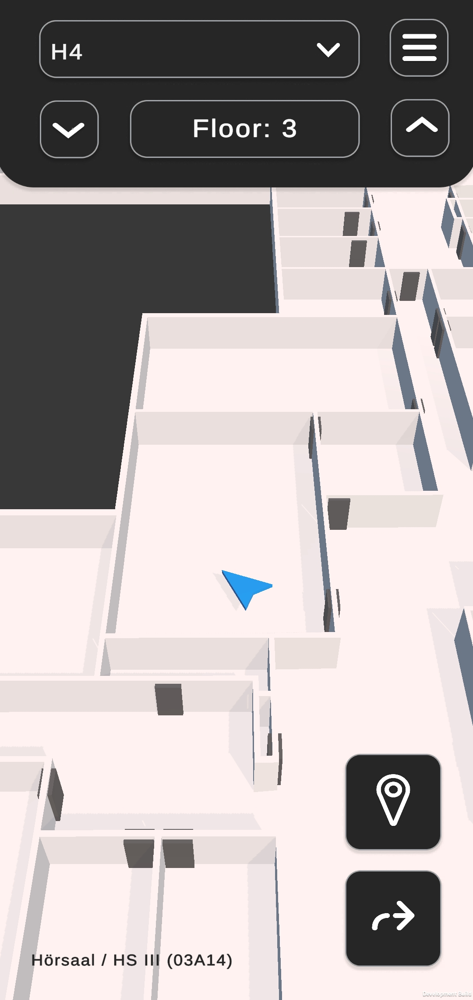
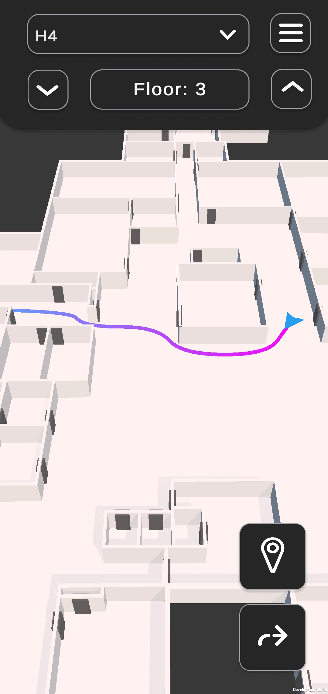
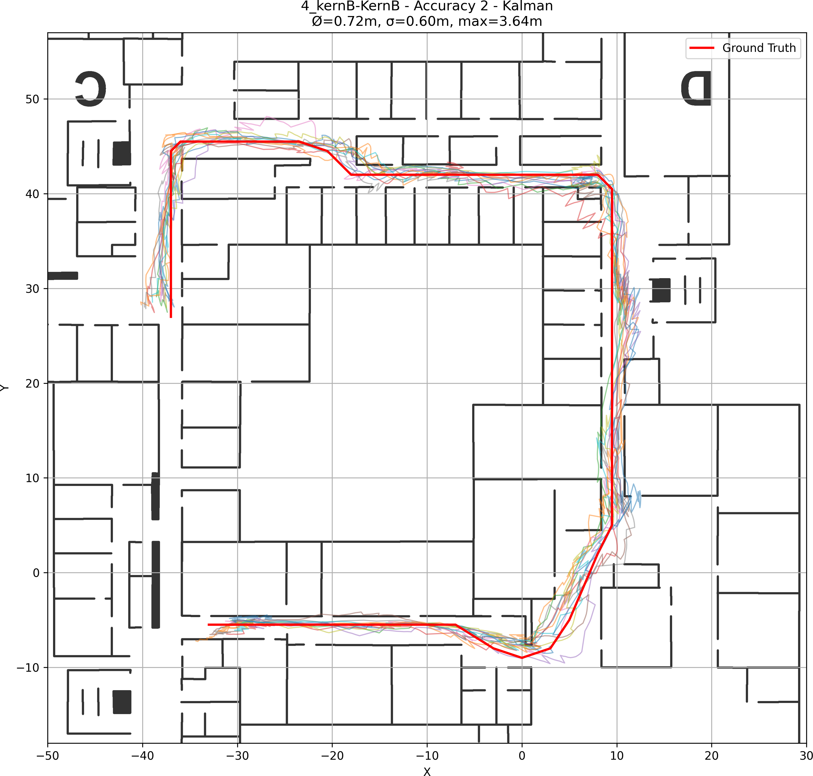

# IndoorNavigator – <br> Precise Indoor Navigation Using Standard Smartphones


A scalable indoor positioning system combining Wi-Fi fingerprinting, IMU sensor fusion, and Kalman filtering to deliver meter-level accuracy on standard smartphones. Features automated generation of 3D maps from GeoJSON, navigation graph creation, pathfinding, real-time 3D visualization, and a simple data visualization script.


<br>


# Problem Statement & Motivation
GPS is unreliable or unavailable indoors, causing navigation apps to fail.

Wi-Fi fingerprinting provides absolute position estimates but is noisy, inconsistent, and discrete in time. IMU sensors offer continuous motion data but suffer from drift and cumulative errors. By combining both data sources this project balance their weaknesses, improving accuracy and stability.

Unlike approaches relying on trilateration (which is very inaccurate), or systems demanding pricey setups and maintenance like BLE beacons, this project aims to develop a scalable, maintainable, and accurate indoor navigation system usable with off-the-shelf smartphones, requiring no additional infrastructure.

<br>

## Project Overview


```
├── geoJsonParser/        → Python module converting GeoJSON spatial data into:
│                         - optimized 3D floor models (.obj)
│                         - multi-level navigation graphs (grid- and door-based)
│                         - configuration files for app integration
│  
├── navigatorAppUnity/    → Unity Android app combining:
│                         - Wi-Fi fingerprinting
│                         - IMU sensor fusion
│                         - Kalman filter for position estimation
│                         - interactive 3D map visualization & pathfinding
│  
├── posDataInspector/     → Python scripts for:
│                         - analyzing collected positioning data
│                         - visualizing accuracy and deviations
│                         - statistical evaluation of filter performance
│  
├── IndoorNavigator.apk   → Final Android build, deployable without Unity
```
<br>


## Technical Approach

- **Wi-Fi Fingerprinting:** Collects signal strength fingerprints, maps them to known reference points.  
- **IMU Sensor Fusion:** Uses accelerometer and gyroscope data for motion tracking and orientation estimation.  
- **Kalman state estimation:** Combines noisy sensor data into a smooth, accurate position estimate.  
- **Automated Map Generation:** Parses GeoJSON building layouts to generate 3D models and navigation graphs, enabling easy addition of new buildings.  
- **Interactive 3D Navigation:** Unity app visualizes user position and routes in real-time.

<br>


## Installation & Usage

1. Install `IndoorNavigator.apk` on any standard Android smartphone.  
2. Disable Wi-Fi scan throttling to enable frequent fingerprint collection.  
3. Grant location permissions when prompted.  
4. Select building and floor within the app.  
5. The app shows the current user position or prompts if unavailable.  
6. Start navigation to any room; path is displayed on the 3D map.

Notes:
* The app is preconfigured for selected university buildings
* New buildings can be added by placing `config.json` and `graph.json` into `Resources/Buildings` and copying the folder with all generated `.obj` building models from `geoJsonParser` into `Resources/Prefabs`
* Use Setup Mode in the app to initialize the building. Data can be exported or imported via the app’s Settings. To auto-import data on startup, see the `Database.cs` script.

<br>


## Results & Evaluation

- Evaluated with multiple configurations in a realistic indoor scenario (see screenshot below).
- Positioning accuracy achieves sub-meter error in most cases, demonstrating precise tracking performance in realistic indoor scenarios (see table below).
- all values in meters; each data point based on 12 measurements:

| Filter Type | Accuracy (m) | Mean | Std Dev | 25% | Median | 75% | 95% | Max |
|-------------|--------------|------|---------|-----|--------|-----|-----|-----|
| Kalman      | 0.5          | 0.79 | 0.59    |0.37 | 0.64   |1.09 |1.90 |4.26 |
| Kalman      | 1            | 0.72 | 0.68    |0.24 | 0.51   |1.01 |2.10 |4.74 |
| Kalman      | 2            | 0.72 | 0.60    |0.26 | 0.55   |1.03 |1.93 |3.64 |
| Simple      | 0.5          | 0.97 | 0.77    |0.34 | 0.79   |1.42 |2.50 |4.41 |
| Simple      | 1            | 0.91 | 0.85    |0.27 | 0.66   |1.27 |2.66 |5.85 |
| Simple      | 2            | 0.83 | 0.70    |0.30 | 0.66   |1.17 |2.15 |5.71 |

- Visualizations (see screenshots) confirm the system reliably tracks paths close to ground truth.
- For detailed methodology and analysis, see the full Bachelor's thesis.

*(Additional plots and statistical analysis are available in `/posDataInspector/resources/Graphics/interesting`)*

<br>


## Limitations & Future Work

- Accuracy decreases in areas with poor Wi-Fi coverage or strong signal interference.
- The current Kalman filter tuning is static; adaptive filtering could improve performance.
- Fingerprinting requires manual data collection; future improvements may include crowdsourcing or predictive modeling.
- Integration of magnetic field measurements could also be considerd as a additional source of absolute position data.
- The system’s data becomes outdated as the Wi-Fi environment changes. The implemented update mode attempts to mitigate this but introduces bias toward frequently visited locations.


<br>

## Screenshots


### View with current position shown and active navigation in the 3D map.
<p float="left">
  
  
</p>


### Data analysis: estimated paths vs actual walked path (12 samples, Kalman filter, accuracy = 2)




For implementation details, methodology, and evaluation, see the corresponding Bachelor's thesis.

## Author

**Nico-Kevin Jacobi**
Computer Science Student at Philipps-University Marburg
Bachelor's Thesis, 2025.

Licensed under MIT, feel free to use, modify and share.

---

