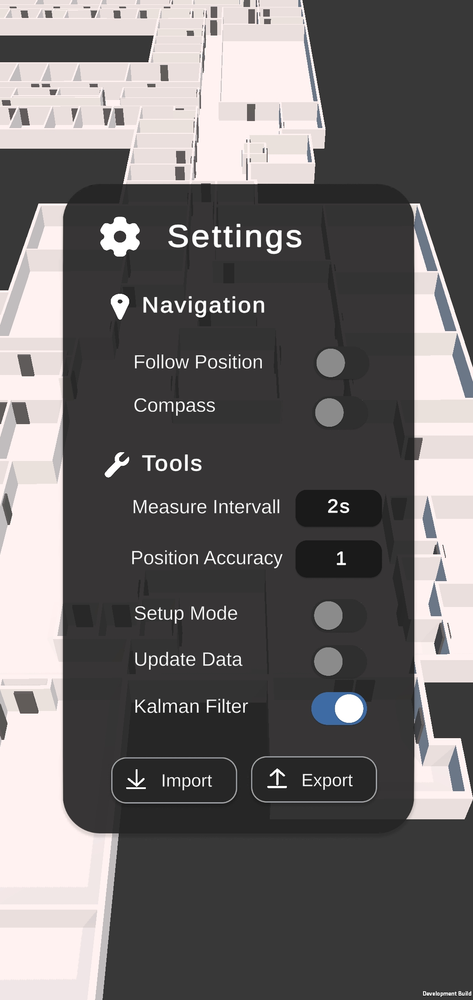
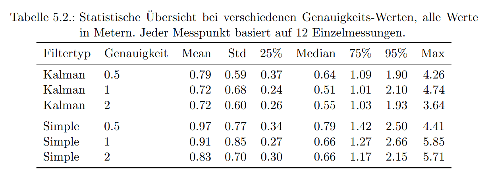

# IndoorNavigator – Indoor Navigation with Standard Smartphones

This repository contains the solution developed by Nico-Kevin Jacobi as part of a Bachelor's thesis on indoor positioning and navigation within the buildings of Philipps-University Marburg. The objective is to create a scalable, maintainable, and accurate system that enables effective orientation in complex indoor environments. Images of the application and statistical results are below.


## 🗂 Project Overview
```
├── geoJsonParser/        → Python tool to convert GeoJSON into 3D models, navigation graphs, and config files  
├── navigatorAppUnity/    → Unity app for indoor navigation using Wi-Fi & IMU sensor fusion  
├── posDataInspector/     → Analysis and visualization of collected position data  
├── IndoorNavigator.apk   → Installable Android application  
```

<br>


## 📍 geoJsonParser

Python module for automated processing of GeoJSON spatial data:

* Parsing GeoJSON into useful data structures
* Optimizing and correcting the data
* Generating a two-level navigation graph (grid- and door-based)
* Generating 3D models for each floor (as `.obj`)
* Exporting models, graph, and config file

See `main.py` for details.


<br>


## 🧭 navigatorAppUnity

Unity project for Android for position estimation and navigation:

* Displays user location on an interactive 3D map
* Sensor fusion: Wi-Fi fingerprinting + IMU + Kalman filter (alt: custom filter)
* Navigate to any room
* Add new buildings easily using data from geoJsonParser
* Collect Wi-Fi fingerprints directly in the app
* Various settings, import/export support


<br>


## 📊 posDataInspector

Python script for analysis and visualization of position data:

* Contains all data collected during the project
* Calculates statistical metrics
* Generates visualizations of the results

The most relevant visualizations are located in `posDataInspector/resources/Graphics/interesting`. Running `main.py` will generate additional plots.
See `main.py` for more info.


<br>


## 📱 IndoorNavigator.apk

The final Android app, usable without the Unity editor.

### Installation:

1. Transfer the APK to an Android device and install it
2. Disable Wi-Fi throttling ("Wi-Fi scan throttling" → off)
3. The database initializes on first launch
4. Grant location permissions when asked
5. If a position can be determined, it will be shown on the map – otherwise, a dialog appears
6. Select building and floor at the top; bottom right: "jump to current position" and "start navigation"


<br>


## 🧪 Notes

* The app is preconfigured for selected university buildings
* New buildings can be added by placing `config.json` and `graph.json` into `Resources/Buildings` and copying the folder with all generated `.obj` building models from `geoJsonParser` into `Resources/Prefabs`
* Use Setup Mode in the app to initialize the building. Data can be exported or imported via the app’s Settings. To auto-import data on startup, see the `Database.cs` script.


<br>

## 🖼 Screenshots

### Standard view with user position and current room on 3D map


### Active navigation showing the path


### Settings menu



### Data analysis: estimated paths vs actual walked paths (6 samples, Kalman filter, accuracy = 2)


### Statistical results table: deviation to next actual position (in meters)



## 📝 More Information

For implementation details, methodology, and evaluation, see the corresponding Bachelor's thesis.

## 👤 Author

**Nico-Kevin Jacobi**
Computer Science Student at Philipps-University Marburg
Student ID: 3663174
Bachelor's Thesis, 2025

---

© 2025 – All rights reserved.
